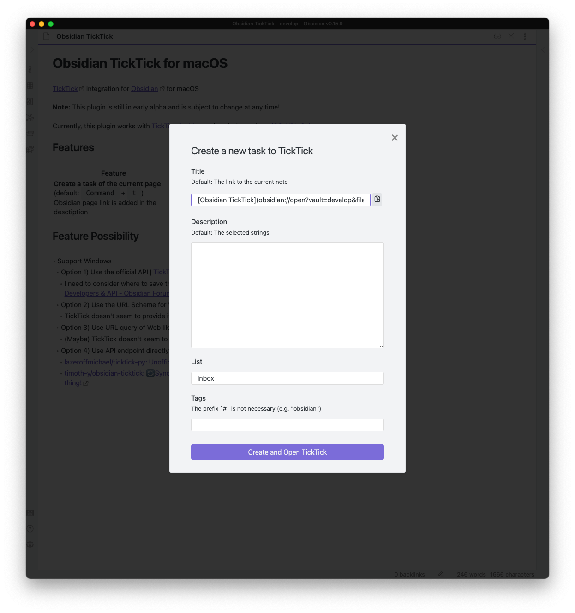

# Obsidian TickTick

[TickTick](https://ticktick.com/home) integration for [Obsidian](https://obsidian.md)

**Note:** This plugin is still in early alpha and is subject to change at any time!

Currently, this plugin works with [TickTick for Mac](https://ticktick.com/about/mac) since it depends on [iOS-URL-Scheme](https://support.ticktick.com/hc/en-us/articles/360007930051-TickTick-iOS-URL-Scheme)

## Features

<table>
<thead>
<tr>
<th>Feature</th>
<th>Screenshot</th>
</tr>
</thead>
<tr>

<tr>
<td>
<b>Create a task of the current page</b> (default: <kbd>Command</kbd> + <kbd>t</kbd>)
<ul>
<li>Obsidian page link is added in the desctiption</li>
</ul>
</td>
<td>

</td>
</tr>

</table>